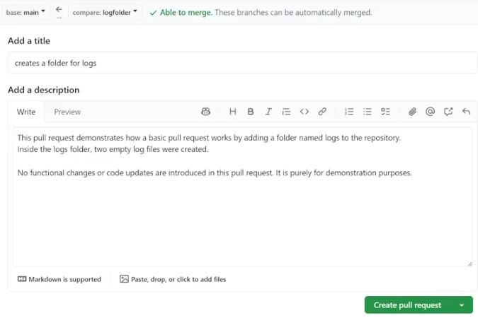

# Chapter 6 - Important Concepts in Git

When working with Git there are some files you probably don't want to track.
- log files
- personal configuration file

In cases like this there is a special file called ".gitignore" that you can use to tell Git not to track files, folders, or use wildcards to match a given pattern such as files ending with ".log". The ".gitignore" file is a plain text file and Git understands anything listed inside of it should be ignored.

To try this out, first create two sample log files that we will attempt to ignore with Git. These files can be put in a directory named "Second_Folder" 
ATTENTION: These files are NOT staged or committed.
- Second_Folder/log01.log
- Second_Folder/log02.log

Now, create a new file named ".gitignore". Inside this file we can specify what is ignored.

[.gitignore]
<pre>
node_modules
.tmp
npm-debug.log

log02.log
</pre>

Save this file and you should see that we have 2 modified files instead of three. You will also see that the file "log02.log" is grayed out in the file explorer.
- .gitignore
- log01.log

NOTE: ignoring "log02.log" will ignore the file regardless of whether it is in a folder or not.

Let's modify our ".gitignore" file to ignore the folder "Second_Folder". After saving this change, both "log01.log" and "log02.log" are ignored.

[.gitignore]
<pre>
node_modules
.tmp
npm-debug.log

log02.log

Second_Folder
</pre>

So right now any file named "log02.log" and all files in the folder "Second_Folder" are ignored by Git.

We can also use a wildcard to match multiple files. For example if we wanted to matach all files that end with ".log" that are in the "Second_Folder" folder, we could do the following.

[.gitignore]
<pre>
node_modules
.tmp
npm-debug.log

log02.log

Second_Folder/*.log
</pre>

It is important to understand .gitignore only works on files that weren't previously tracked. If you want Git to ignore a previously tracked file there are several suggestions, one of them is removing the file.

To try this out, first create two sample log files that we will attempt to ignore with Git. These files can be put in a directory named "Second_Folder" 
ATTENTION: These files are NOT staged or committed.
- Second_Folder/log01.log
- Second_Folder/log02.log

Now, create a new file named ".gitignore". Inside this file we can specify what is ignored.

[.gitignore]
<pre>
node_modules
.tmp
npm-debug.log

log02.log
</pre>

Save this file and you should see that we have 2 modified files instead of three. You will also see that the file "log02.log" is grayed out in the file explorer.
- .gitignore
- log01.log

NOTE: ignoring "log02.log" will ignore the file regardless of whether it is in a folder or not.

Let's modify our ".gitignore" file to ignore the folder "Second_Folder". After saving this change, both "log01.log" and "log02.log" are ignored.

[.gitignore]
<pre>
node_modules
.tmp
npm-debug.log

log02.log

Second_Folder
</pre>

So right now any file named "log02.log" and all files in the folder "Second_Folder" are ignored by Git.

We can also use a wildcard to match multiple files. For example if we wanted to matach all files that end with ".log" that are in the "Second_Folder" folder, we could do the following.

[.gitignore]
<pre>
node_modules
.tmp
npm-debug.log

log02.log

Second_Folder/*.log
</pre>

It is important to understand .gitignore only works on files that weren't previously tracked. If you want Git to ignore a previously tracked file there are several suggestions, one of them is removing the file.

## The .git folder
A git repository has a hidden ".git" folder. By default VSCode hides these files but you can make these visible. In VSCode open the Command Palette. 
Windows: ctrl + shift + p 
Mac: cmd + shift + p

With the Command Palette open, type "user settings" and select the option "Preferences: Open User Settings (JSON)". This allows you to create your own settings and one is the ability to show hidden files.
<pre>
{ 
"files.exclude": {
"**/.git": false
}
}
</pre>

If you have saved the "settings.json" in your project, you should now see the hidden ".git" folder.

Within the ".git" folder there is a file named "config" which holds details about your repository.

It is NOT suggested to change anything in the ".git" folder as it may break your repository.

If you delete the ".git" folder, you will no longer have a Git repository. Instead, you will just have a plain file system directory

## Create a Branch in Your Repository
A branch is like a separate copy of your repository that you can work on separately.

A branch can be helpful when
- developing new features without modifying production code
- multiple people are working on the same project at the same time

Let's walk through how this works
1. First there is the main repository
2. When you make a *branch* you are making a copy of this repository 
   SIDE NOTE: You can make a branch of a remote or local repository
3. Once you have a branch you can make changes in it without modifying the original repo.

Try it out! 
The instructor shows how to create a new branch in your local environment, create files in the branch, then push it to your remote repository.

The steps taken include:
1. make sure the working tree is clean
2. create a new branch and switch to the new branch
3. create new content in the branch
4. stage and commit all changes
5. push changes to the remote repository
6. verify the branch on GitHub

So let's get started:
1. Step one is to make sure your working tree is clean by using the `git status` command. 
    

    <pre>
    /$ <code>git status</code>
    <samp>On Branch main
    Your branch is up to date with 'origin/main'
    
    nothing to commit, working tree is clean</samp>
    </pre>

2. Use `git branch <branch name>` to create a new branch. Give it a name that describes its purpose, such as a new feature you are developing. In this example the instructor created a new branch named "logfolder". 
    

    <pre>
    /$ <code>git branch logfolder</code>
    </pre>
    The new branch "logfolder" is created, but we need to switch to the new branch before we start working on it. This is done with the <code>git checkout &lt;branch name></code> command.
    <pre>
    /$ <code>git checkout logfolder</code>
    <samp>Switched to branch 'logfolder'</samp>
    

3. Create a folder named "logs" in your new branch, with two files, "logs01.log" & "logs02.log". 
    

    <pre>
      logs/
        logs01.log
        logs02.log
    </pre>
    

4. Add all changes to the Staging area and then commit these changes. 
    

    <pre>
    /$ <code>git add .</code>
    /$ <code>git commit -m "creates a folder for logs"</code>
    </pre>
    

5. Attempting to push this changes results in an ERROR! Git points out that our branch "logfolder" is in the local repo but not found in our remote repo. It says, "logfolder has no upstream branch". 
TERM: *Upstream branch* - An upstream branch in Git refers to a branch that serves as a reference point for another branch. 
    

    <pre>
    /$<code>git push</code>
    <samp>fatal: The current branch logfolder has no upstream branch. 
    To push the current branch and set the remote as upstream, use
    
        git push --set-upstream origin logfolder
    
    To have this happen automatically for branches without a tracking upstream, see 'push.autoSetupRemote' in 'git help config'.</samp>
    </pre>
    So in order to make this work, we must take Git's advice and specify the upstream branch.
    <pre>
    /$ <code>git push --set-upstream origin logfolder</code>
    </pre>

6. Go to GitHub and view your repo. You should see there are two branches. If you look closely, when you are on the main branch there is no "logs" folder, it is only found in the new "logfolder" branch.

## Create and merge a pull request
This lesson explains how to make a *pull request*. 
TERM: Pull Request - A *Pull Request* is a request to merge two separate branches. This process allows others to review and accept changes before merging the branches.

In a local repository you would typically merge the two branches without a pull request. But when working on a team or a larger project a pull request is a better way. A pull request provides a way for other team members to review and accept changes from your branch. It is a best practice to delete the other branch once it has been merged with the other branch.

On GitHub navigate to your repository. In the top menu you will see a "Pull Requests" button. This opens up an interface with a green button "New pull request". If an existing pull request exists, it is displayed on this screen. 

In the last lesson, the instructor created a new branch "logfolder" and pushed it to the remote repo. You should see this when you click "New pull request". You can compare the two branches. You will see two branches separated by an arrow. The left branch is "base: main" and the right branch you can select from the dropdown as "logfolder". After you select "logfolder" you should be able to see all the changes you made on this new branch in comparison to the main branch. GitHub also shows green text "Able to merge" at the top if the two branches can be merged. With the two branches visible (main & logfolder), click on the "Create pull request" button to start the process. An interface allows you to create a title & description for your pull request. In this lesson the instructor provides a title of "creates a folder for logs", and provides a description that this is for demonstration purposes of how to use a pull request and that the log files are empty and no functional changes were made.

1. Go to GitHub and click "Pull Requests" from the main menu
2. Click on the green button "New pull request"
3. The "Compare changes" page is displayed. Here you can select which branches you are attempting to merge. Make sure the left box says "base:main" and the right box says "compare:logfolder". The logfolder branch is the one that will be merged with the main branch. Feel free to review the changes.
4. With the two branches selected (base:main & compare:logfolder) and GitHub is displaying a green message "Able to merge", click the green "Create new pull request" button. 
5. A new interface is displayed allowing you to enter a title and description. After entering a title & description, click the green button "Create pull request".  
   
6. This pull request is now available for feedback and review. Under the "Conversation" tab, you can ask someone to review the code to spot mistakes. Changes can be viewed by selecting the "Files changed" tab/button above the newly created pull request. 
Since we own this remote repo we can accept the changes by clicking the green button "Merge pull request". You can choose to change the commit message before merging the branches, then click the "Confirm Merge" button to merge. 
NOTE: Only people with write access to a repository can merge branches. If you are contributing to someone elses repo it is up to them to response and update their repo. Don't expect a speedy response from all GitHub users.

If this was successful you will see the "logs" folder is now part of your main branch in your remote repository.

The final step is to delete the "logfolder" branch we created earlier. 
The instructor fails to show how to do this but it is pretty straight forward on GitHub.
1. Navigate to your remote repository. You should see your repository files. Above this is a menu with the branch name, such as "main", followed by a button "branches". Click on the button "branches" to see a list of branches. 
2. Then to the right of the "logfolder" branch you will see an icon that looks like a garbage can. Click this button to delete the branch.
3. Go back to the main page for your remote repository. You should see the merged data is still in your repository, but you will also see that branch is no longer listed in the top menu (previously is said 2 branches now it says 1 Branch). Clicking on branch button above your repo files will show the branch does not exist anymore.
4. On your local repo you will still have the "logfolder" branch. To delete this you can use the `git branch -d <branch name>` command.  
    1. 
View all branches 
        <pre>
        <code>git branch</code>
        <samp>* main
        logfolder</samp></pre>
        

    2. 
Delete the logfolder branch 
       <pre>/$ <code>git branch -d logfolder</code></pre>
       

    
    3. 
Confirm deletion 
       <pre>/$ <code>git branch</code>
       <samp>* main</samp></pre>
       

## Git Commit Messages
Git commit messages are important in explaining what happened in a specific commit. Best practices for commit messages include:
1. Describe exactly what changes were applied
2. Describe in the present tense. 
   For example, instead of saying you "fixed" something, use "fixes" something.
3. The commit message should be no more than 50 characters.
4. An optional detailed explanation can be added if a blank like is provided. 
   To write a multi-line comment you simply use the `git commit` command, minus the "-m 'some message'" part. When you do this it opens the editor you specified for your environment. The title is on the first line, followed by a blank line, then the detailed message. 
   When you close the editor, the commit is complete.
   <pre>
   Added LinkedinLearning to gitStatusDemo.md 

   This commit doesn't serve a real purpose. It is used to
   demonstrate how to create a more detailed commit message.
   </pre>

Clear and detailed commit messages are very helpful to understand what was actually done.
 
